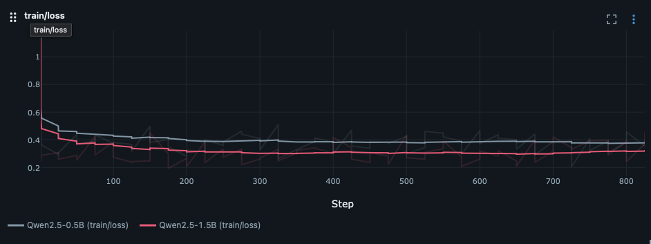
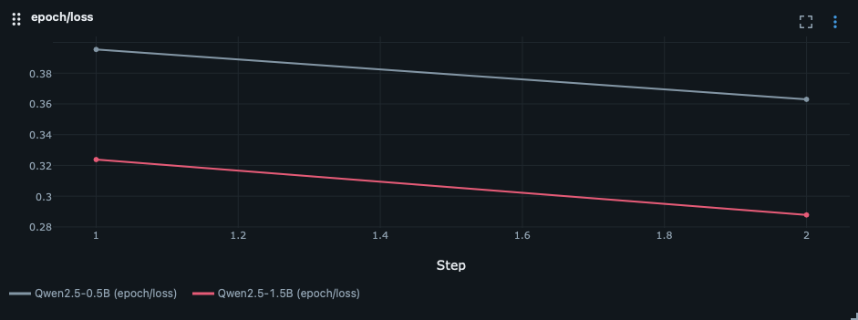
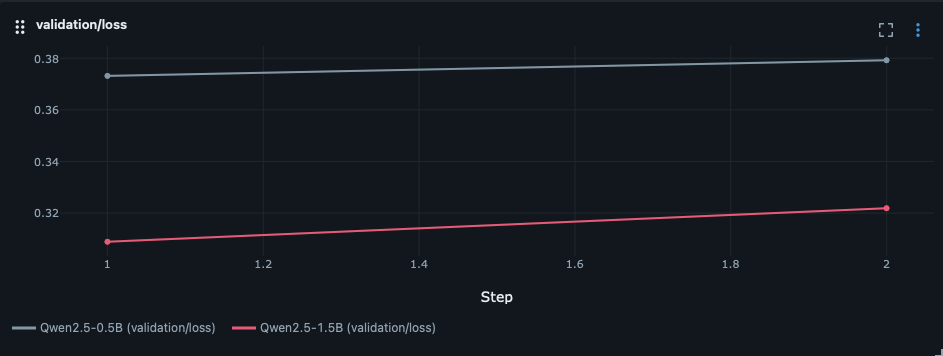

# SymPy-RLVR: Verifier-Guided Training for Mathematical Reasoning

**Reinforcement Learning with Verifiers (RLVR)** for improving mathematical reasoning in smaller language models.

The core idea is simple: instead of relying on human labels or LLM judges, we use **programmatic verification with SymPy** to automatically check whether a model’s answer to a math problem is correct. The verifier provides a reward signal that can later be used for reinforcement learning.

## Project Goal

Train a small language model to solve mathematical problems while using **symbolic verification as the reward signal**.

## Training Snapshot

The current SFT run was trained on a single `RTX 2000 ADA` GPU. The charts below show the batch-level training loss, the epoch-level aggregate loss, and the held-out validation loss for the same run.
GSM8K bench success rates at **22%** on **100 samples**.











### Finetuning steps

```bash
# Synthesize questions
python -m verifier.q_synthesis --size 500 --easy --medium --hard --semaphore 5 --out-file synth_v1.parquet

# Train
python -m rl.grpo \
  --run-id <sft_mlflow_run_id> \
  --synth-path data/synth_v1.parquet \
  --epochs 3 \
  --G 8 \
  --alpha 1e-5

# Chat / benchmark with RL adapter
python -m models.chat --run-id <rl_mlflow_run_id>
```
