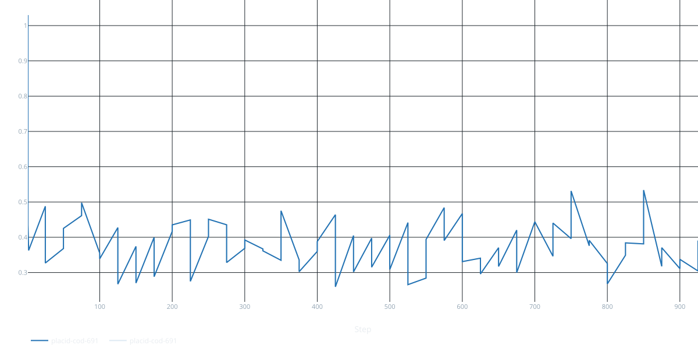

# SymPy-RLVR: Verifier-Guided Training for Mathematical Reasoning

**Reinforcement Learning with Verifiers (RLVR)** for improving mathematical reasoning in smaller language models.

The core idea is simple: instead of relying on human labels or LLM judges, we use **programmatic verification with SymPy** to automatically check whether a model’s answer to a math problem is correct. The verifier provides a reward signal that can later be used for reinforcement learning.

## Project Goal

Train a small language model to solve mathematical problems while using **symbolic verification as the reward signal**.

## Training Snapshot

The current SFT run was trained on a single `RTX A4500` GPU. The plot below shows the recorded training loss over that run.

